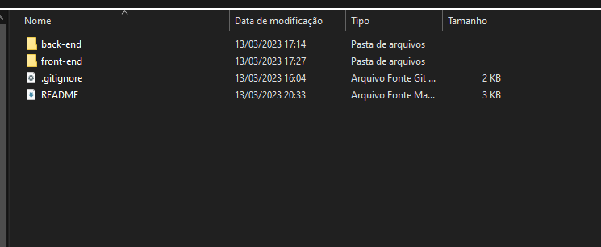
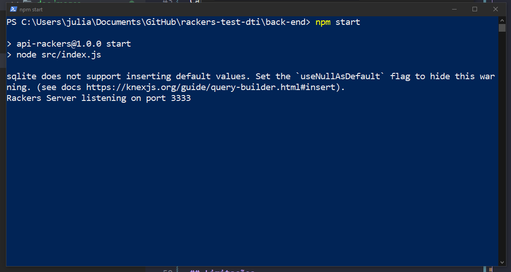
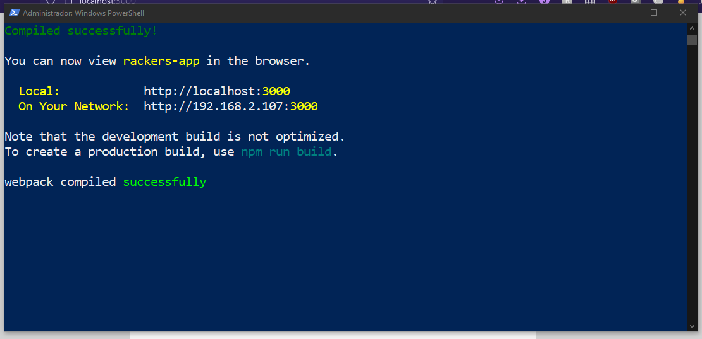
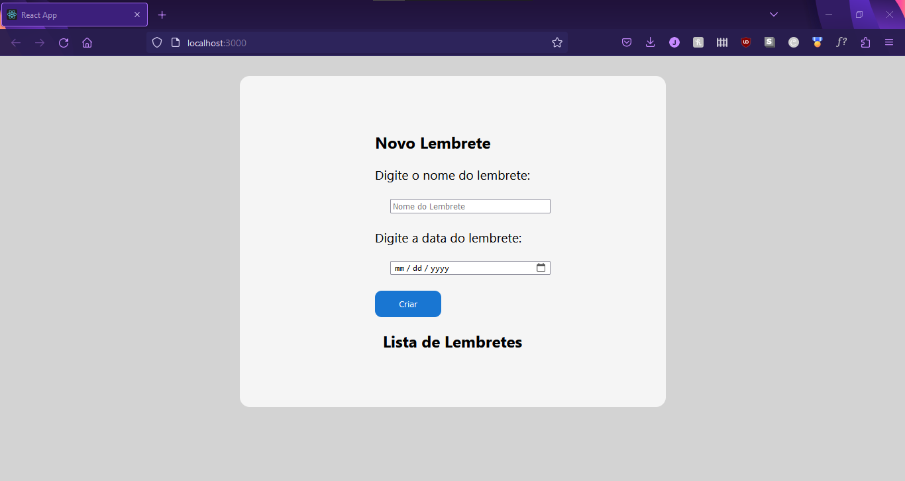

# Ferramenta de Lembretes - Teste dti

Repositório contendo o código desenvolvido durante o processo seletivo da dti, que consiste em uma ferramenta de lembretes. A ferramenta construída é baseada em Web, utilizando a linguagem JavaScript em sua implementação.

A stack do JavaScript foi escolhida devido à familiriadade com a linguagem, assim como a disponibilidade de materiais de estudo desenvolvidos anteriormente.

<hr/>

## Front End

O front end da aplicação foi desenvolvido com React.js, sem a utilização de bibliotecas de componentes. A aplicação é single page e apresenta apenas uma tela principal com o formulário de preenchimento dos lembretes e o botão de submissão. Abaixo do formulário são listados os lembretes cadastrados.

Para que os lembretes sejam cadastrados, é feita uma validação dos campos do formulário, o campo nome não pode estar vazio e o campo de data deve ser no futuro.

Os dados são buscados de uma API, fornecida por um back end implementado em Node.js. O transporte dos dados é feito por meio do formato JSON e a ferramenta utilizada para realizar requisições ao back end é o axios.

O axios é um cliente para o navegador e para node.js que realiza requisições http.


<hr/>


## Back End

O back end da aplicação foi desenvolvido utilizando Node.js. Para a construção do servidor que serve de API para o front end foi utilizado o framework Express. Essa ferramenta foi escolhida por sua facilidade e por familiaridade.

O Express é um framework para aplicativos da web do Node.js, permitindo criar uma API de forma rápido utilizando métodos HTTP, entre outros.

Para a criação da base de dados, foi utilizado o Knex.js, que é um Query Builder para alguns dos bancos de dados mais utilizados. O banco de dados utilizado foi o sqlite3, por se tratar de uma aplicação simples e por ser um banco de desenvolvimento.

O Knex fornece os arquivos necessários para conexão com o banco, assim como migrações para modelar os dados e criar as tabelas de forma rápida. O nodemon foi utilizado como dependência de desenvolvimento para que a aplicação carregasse de forma automática a cada alteração.

## Como executar a aplicação

O código da aplicação se encontra hospedado em meu Github pessoal:

<https://github.com/juliamsousa/rackers-test-dti>

É possível clonar o código a partir do Git. A seguir temos uma visão geral da estrutura do projeto. Os módulos de front end e back end estão separados, a documentação se encontra na raiz do projeto e um aruivo gitignore também está configurado.



Cada módulo do projeto deve ser executado de forma separada. Desse modo, deve-se abrir um terminal na pasta back end e outro na pasta front end. Para executar ambos
é necessário primeiramente executar o comando:

````
npm i
````
Desse modo, o gerenciador de pacote do Node.js instalará as dependências necessárias em ambos, tando no front quanto no back end. Essas dependências se encontram na pasta node_modules.

Para executar os módulos executar o comando a seguir, em ambos terminais.

````
npm start
````

Imagem do back end em execução:




Imagem do front end em execução:




Imagem da interface da aplicação no browser:



<hr>

## Limitações

Não foram utilizados CSS/SCSS modules ou Styled Components, apenas CSS puro. Além disso, os lembretes não estão categorizados por sua data, nem exibidos em ordem cronológica. São exibidos na ordem em que são cadastrados. Também não foram implementados testes unitários para o front ou back end.